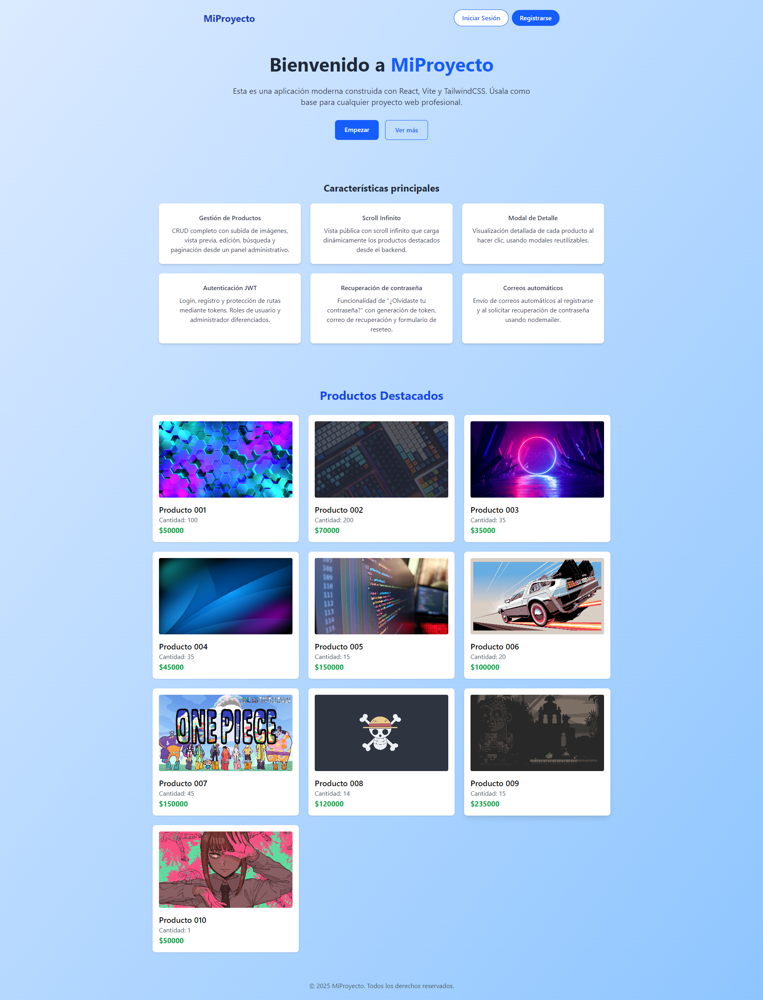
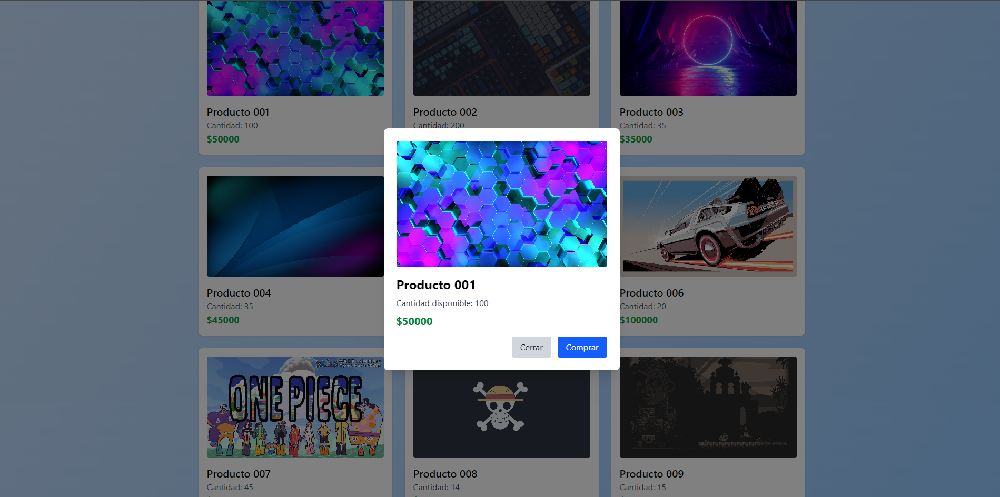
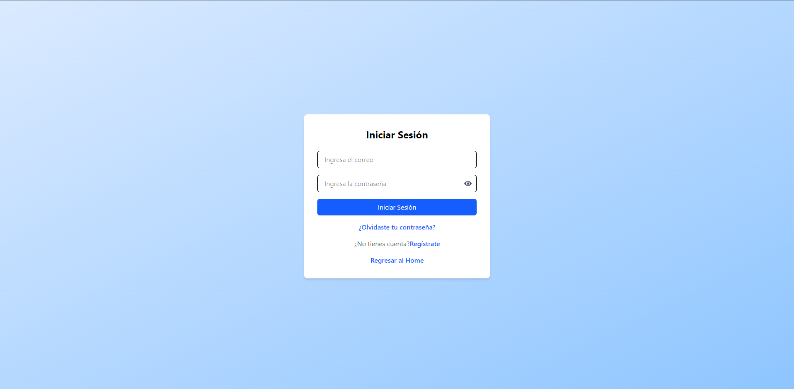
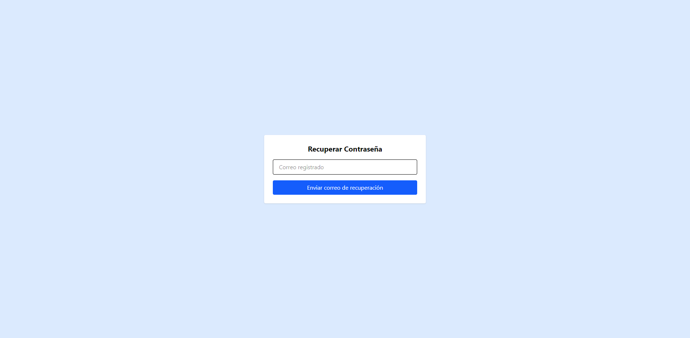
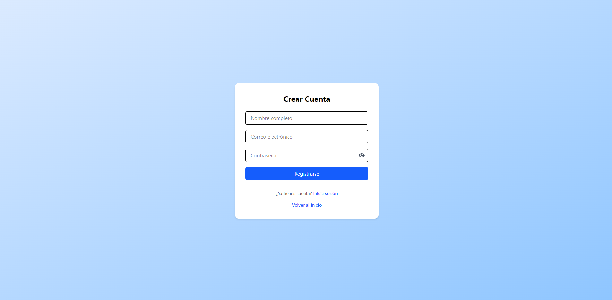
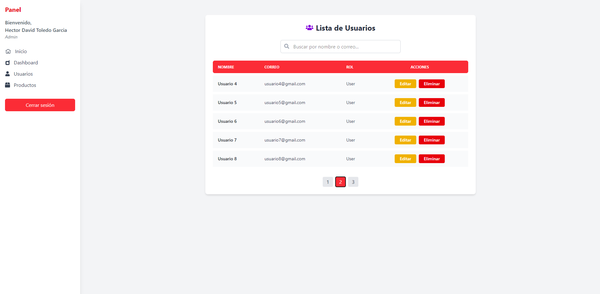
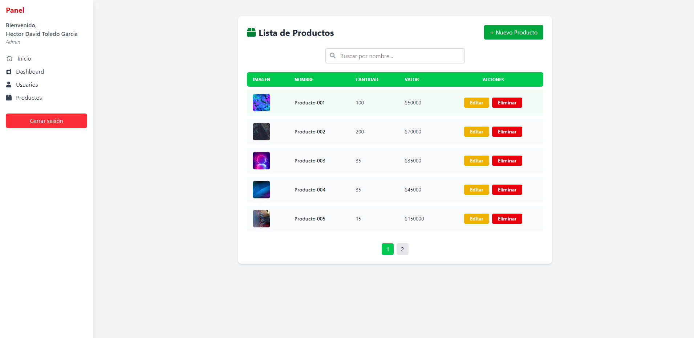
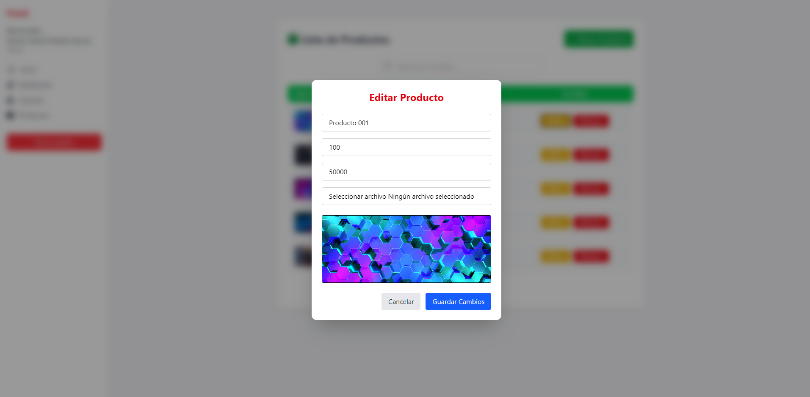
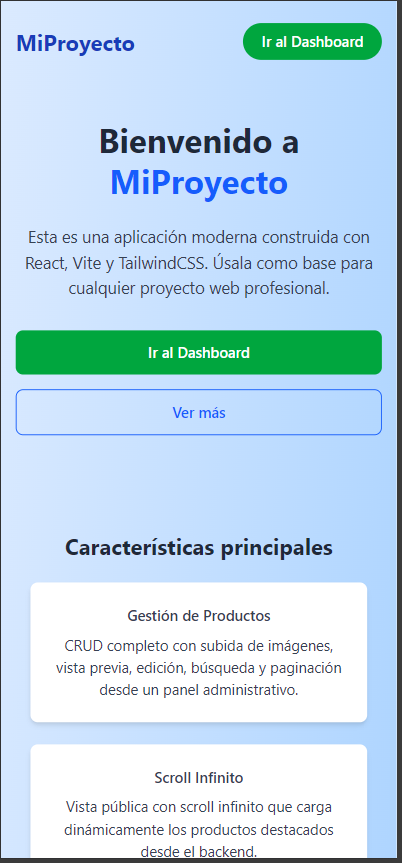
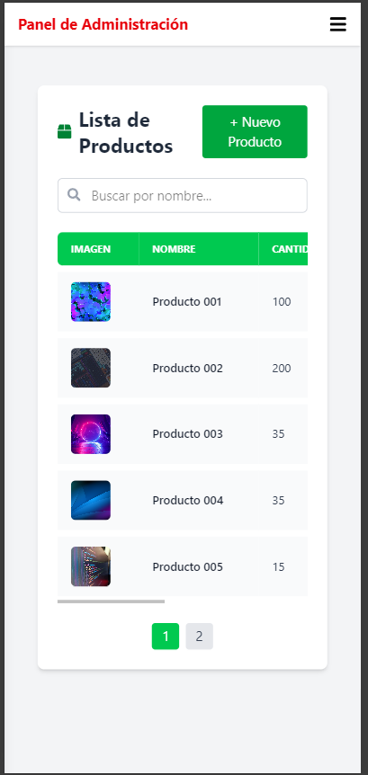

# 🧠 Proyecto Base Full Stack MERN: Autenticación, Gestión de Usuarios y Productos

Este proyecto es una **plantilla funcional avanzada** que integra un **frontend en React + Vite** con un **backend en Node.js + Express + MongoDB** para implementar:

- Autenticación de usuarios con JWT.
- Gestión y CRUD de usuarios desde un panel administrativo.
- Recuperación de contraseña por correo electrónico.
- CRUD de productos con carga de imágenes.
- Visualización de productos en la página principal.
- Modal de producto con detalles y opción de compra.
- Scroll infinito para navegación de productos.
- Scripts unificados de desarrollo con `concurrently`.

Ideal como base para dashboards administrativos, catálogos de productos o aplicaciones e-commerce básicas.

---

## 🗂 Estructura general del proyecto

```
.
├── backend-mongodb/
│   ├── controllers/
│   ├── models/
│   ├── routes/
│   ├── config/
│   └── server.js
│
└── frontend-auth/
    ├── src/
    │   ├── pages/
    │   ├── components/
    │   ├── layouts/
    │   ├── App.jsx
    │   └── main.jsx
```

---

## ✅ Frontend (React + Vite + TailwindCSS)

- Login, Registro y Recuperación de contraseña con validación.
- Redirección dinámica según rol (`admin` / `user`).
- Layout dinámico para cada tipo de usuario.
- Dashboard administrativo con CRUD de usuarios y productos.
- Modal para crear/editar productos con vista previa de imagen.
- Galería de productos en Home con scroll infinito.
- Modal para ver detalles del producto y comprar.
- Protección de rutas mediante `PrivateRoute` y `AdminRoute`.

---

## ✅ Backend (Node.js + Express + MongoDB)

- Endpoints RESTful para login, registro y CRUD de usuarios/productos.
- Autenticación segura con JWT.
- Encriptación de contraseñas con `bcrypt`.
- Verificación por correo para recuperación de contraseña.
- Subida de imágenes de productos con `multer`.
- Controladores separados para usuarios y productos.
- Middleware para validación de tokens y roles.

---

## 🖼 Capturas de pantalla

A continuación, algunas vistas de la aplicación:

1. **Pantalla de Home**
   

2. **Prudctos Modal**
   

3. **Login**
   

4. **Recuperar Contraseña**
   

5. **Registro**
   

6. **Dashboard ADMIN**
   

7. **Productos Admin**
   

8. **Edicion de Productos**
   

9. **Mobile View**
   

10. **Mobile View**
    


---

## 🧪 ¿Cómo correr el proyecto?

### 1. Clonar el repositorio

```bash
git clone https://github.com/hdtoledo/mern-template.git
cd mern-template
```

### 2. Instalar dependencias del backend y frontend

```bash
npm install
```

### 3. Variables de entorno

### 📧 Configuración de envío de correos (Gmail)

Este proyecto utiliza **Gmail con clave de aplicación** para el envío de correos electrónicos (por ejemplo, confirmación de cuenta o recuperación de contraseña). Para que funcione correctamente:

1. Accede a tu cuenta de Gmail.
2. Activa la **verificación en dos pasos**.
3. Ve a [https://myaccount.google.com/apppasswords](https://myaccount.google.com/apppasswords).
4. Genera una nueva **clave de aplicación** (elige "Correo" y "Otro").
5. Copia la clave generada (16 caracteres) y úsala como valor de `EMAIL_APP_PASS`.

#### Backend (`backend-mongodb/.env`)

```env
PORT=5000
MONGO_URI=mongodb://localhost:27017/mern_auth_products
JWT_SECRET=tu_clave_secreta
EMAIL_USER=tu_correo@gmail.com
EMAIL_APP_PASS=tu_contraseña_app
```

---

## 🧰 Endpoints principales

### Autenticación
| Método | Ruta                 | Descripción                        |
|--------|----------------------|------------------------------------|
| POST   | `/api/register`      | Registro de usuario                |
| POST   | `/api/login`         | Inicio de sesión                   |
| POST   | `/api/forgot-password` | Enviar link para reset de clave  |
| POST   | `/api/reset-password/:token` | Restablecer contraseña       |

### Usuarios
| Método | Ruta             | Descripción                    |
|--------|------------------|--------------------------------|
| GET    | `/api/users`     | Listar usuarios                |
| PUT    | `/api/users/:id` | Actualizar usuario             |
| DELETE | `/api/users/:id` | Eliminar usuario               |

### Productos
| Método | Ruta                     | Descripción                   |
|--------|--------------------------|-------------------------------|
| GET    | `/api/productos`         | Listar productos              |
| POST   | `/api/productos`         | Crear producto                |
| PUT    | `/api/productos/:id`     | Editar producto               |
| DELETE | `/api/productos/:id`     | Eliminar producto             |

---

## 🧠 Características técnicas adicionales

- ✉️ Notificaciones por correo para registro y recuperación.
- 🖼 Vista previa de imagen antes de subir.
- 🔁 Scroll infinito para productos.
- 💾 Almacenamiento local de imágenes.
- 🧩 Componentes desacoplados y reutilizables.
- 🔒 Middleware personalizado para roles.

---

## 🤝 Créditos

Desarrollado por [@hdtoledo](https://github.com/hdtoledo)

🚀 Proyecto educativo libre para modificación, mejora y aprendizaje.

---

## 📝 Licencia

Este proyecto se entrega bajo la licencia MIT. Puedes modificarlo, distribuirlo y adaptarlo a tus necesidades. (2025)
